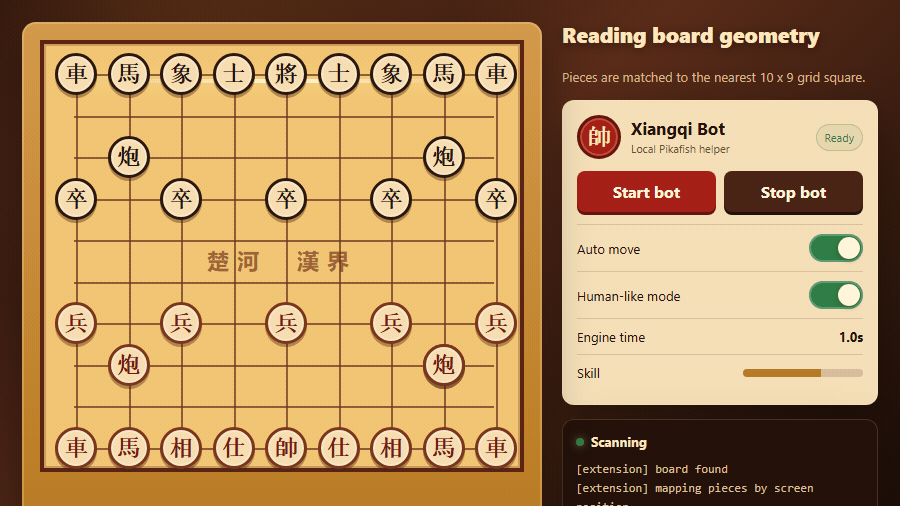

<p align="center">
  
</p>

<h1 align="center">Xiangqi Bot Helper</h1>

<p align="center">
  A Chrome extension and local Pikafish server for reading a Xiangqi board, analyzing positions, and playing moves on <code>play.xiangqi.com</code>.
</p>

<p align="center">
  <a href="LICENSE"></a>
  
  
  
</p>

<p align="center">
  
</p>

---

## The Idea

This project started with a simple question:

> Can a Chrome extension read a live Xiangqi board, ask a real engine for a move, and play it back on the website?

The answer is yes, but the interesting part is not only the engine. The real work is making the browser side reliable:

- reading a 10 x 9 board from DOM geometry,
- detecting whether the board is rotated,
- converting pieces into Xiangqi FEN,
- keeping a local UCI engine alive,
- simulating drag-and-drop moves,
- and making the bot feel controllable instead of mysterious.

This is a learning and local-testing project. Do not use engine assistance against real players.

## What It Can Do

| Area | Feature |
| --- | --- |
| Board parsing | Reads pieces from `play.xiangqi.com` using square and piece positions. |
| Orientation | Detects Red/Black side by checking which king is visually lower on the board. |
| Engine | Talks to Pikafish through a small local Python HTTP server. |
| Fast mode | Plays the engine move immediately. Strongest path. |
| Human-like mode | Adds phase-based thinking and controlled variety. |
| Skill slider | Adjusts how sharp Human-like mode is. Fast mode ignores it. |
| Auto move | Sends drag-and-drop events to move pieces on the board. |
| UI | Xiangqi-themed popup, red piece icon, Start/Stop flow. |

## How It Works

```text
play.xiangqi.com
  -> content.js reads board geometry
  -> board is converted into Xiangqi FEN
  -> extension calls http://127.0.0.1:8080/bestmove
  -> server.py sends UCI commands to Pikafish
  -> Pikafish returns bestmove
  -> extension highlights or plays the move
```

## Modes

### Fast Mode

Fast mode is the direct engine path.

```text
read board -> ask Pikafish once -> play immediately
```

It sends `style: "best"` to the server, ignores the Skill slider, and plays the move returned by Pikafish.

Use Fast mode when you want maximum strength from the selected `Engine time`.

### Human-like Mode

Human-like mode is less mechanical.

It scans the position, adds phase-based thinking time, then asks the server to choose from a controlled group of good candidate moves.

| Phase | Behavior |
| --- | --- |
| Opening | Faster. Many opening moves are close enough. |
| Middlegame | Slower. Tactics matter more. |
| Endgame | Can think longer. Precision matters. |
| Low clock | Under 30 seconds, it moves faster. |

Human-like mode may play weaker than Fast mode. That is intentional.

### Skill Slider

Skill only affects Human-like mode.

| Skill | Behavior |
| --- | --- |
| 1 | Loose. Wider candidate pool, more variety. |
| 3 | Balanced. Good moves, not always PV1. |
| 5 | Sharp. Narrow candidate pool, closer to best move. |

Fast mode always plays the engine move.

## Setup

### 1. Download the engine

```powershell
python download_engine.py
```

This creates the ignored `engine/` directory and downloads Pikafish files.

### 2. Start the local server

```powershell
python server.py
```

Keep this terminal open while using the extension.

### 3. Load the Chrome extension

1. Open `chrome://extensions`
2. Enable `Developer mode`
3. Click `Load unpacked`
4. Select this repository folder

### 4. Start a game board

Open `https://play.xiangqi.com`, enter a board, click the extension icon, then press `Start bot`.

If it stops moving, press `Stop bot`, then `Start bot` again.

## Project Structure

```text
xiangqi-bot/
|-- assets/
|   `-- readme-preview.png
|-- icons/
|   |-- icon-16.png
|   |-- icon-32.png
|   |-- icon-48.png
|   `-- icon-128.png
|-- engine/                 ignored by git, created by download_engine.py
|-- content.js              board reading, overlay, bot loop, auto move
|-- download_engine.py      downloads Pikafish
|-- manifest.json           Chrome MV3 manifest
|-- popup.html              extension popup UI
|-- popup.js                popup behavior and controls
|-- server.py               local HTTP wrapper around Pikafish
|-- LICENSE                 MIT license
`-- README.md
```

## Troubleshooting

### `Board not found`

The extension could not find `#game-grid`.

Fix:

1. Enter an actual game board.
2. Refresh the page.
3. Press `Stop bot`, then `Start bot`.

### Server is not running

Start it again:

```powershell
python server.py
```

### Chrome refuses to load the extension because of `__pycache__`

Python may create `__pycache__` after compile checks. Chrome does not like extension files or folders starting with `_`.

Remove it:

```powershell
Get-ChildItem -Force -Recurse -Directory -Filter __pycache__ |
  Remove-Item -Recurse -Force
```

### Fast mode still feels weak

Increase `Engine time`.

`0.5s` is fast. `1s` is already strong. `2s` to `5s` helps more in tactical middlegames and endgames.

## Technical Notes

- Board parsing uses screen-space distance between piece centers and square centers.
- Side detection is visual, not text-based.
- Move execution uses drag-and-drop events, not simple click events.
- The server uses Python stdlib HTTP APIs, no web framework.
- Pikafish is controlled through UCI over stdin/stdout.
- Human-like candidate selection uses MultiPV and centipawn gaps.

## License

MIT License. See [LICENSE](LICENSE).

## Ethics

This repository is for learning, local testing, and engine experimentation.

Do not use engine assistance against real players. Better directions are review mode, local sparring, post-game analysis, and browser automation research.
